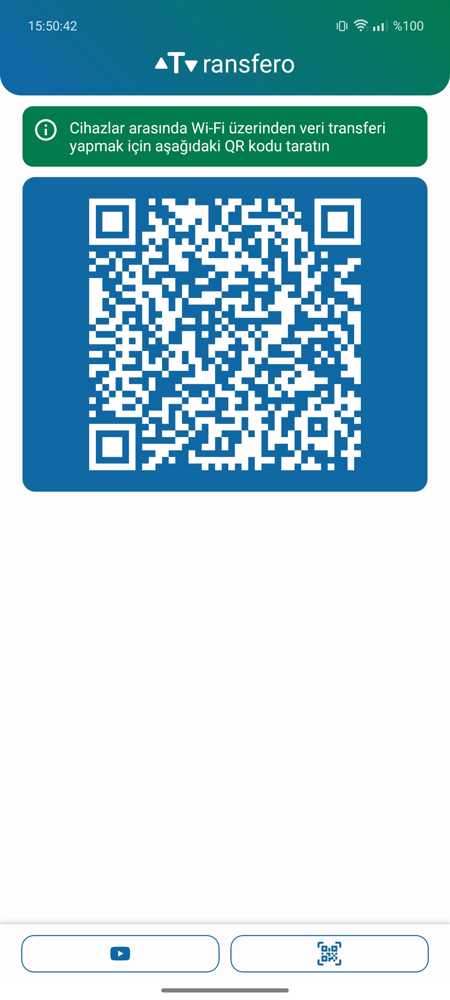
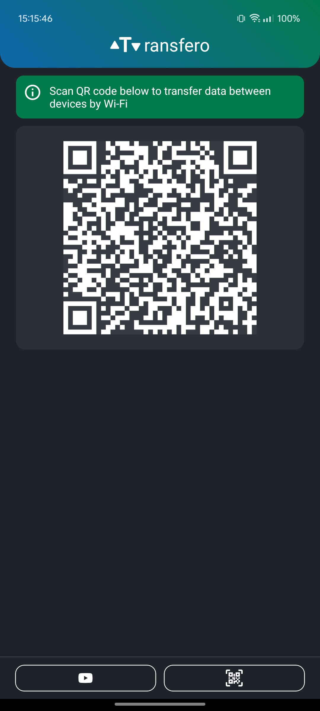
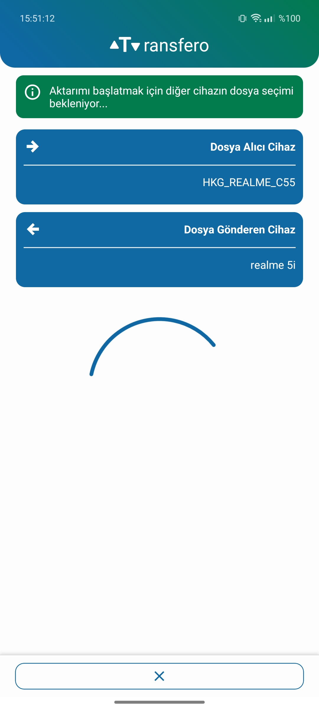
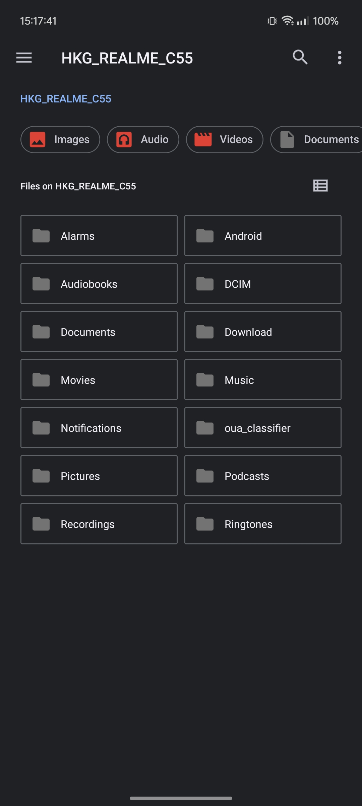
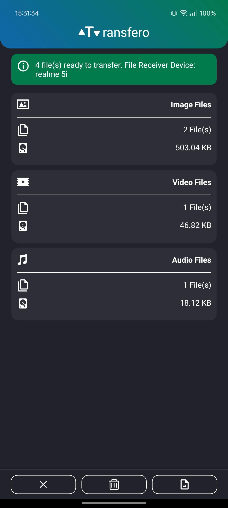
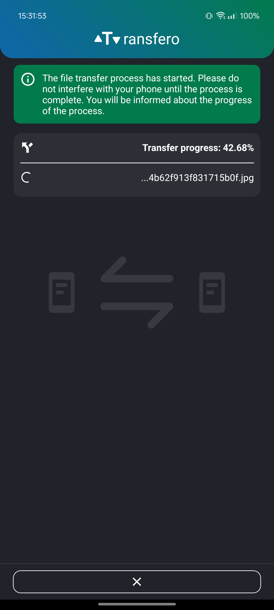

---

# Transfero

**Transfero** is a React Native application designed to make file sharing seamless over Wi-Fi. Helps you transfer files wirelessly between devices on the same network.


## 🚀 Tech Stack

- [React Native](https://reactnative.dev/)
- [TypeScript](https://www.typescriptlang.org/)

## ⚙️ Installation & Setup

To get started with Transfero, make sure you have your environment set up for React Native development.

👉 Follow the official guide here: [React Native - Environment Setup](https://reactnative.dev/docs/set-up-your-environment)

Once your environment is ready:

```bash
npm install
```

To run Transfero on a physical Android device, make sure you have a debug keystore available. If it's missing, you can generate one manually using the following command from `/android/app/`:

```bash
keytool -genkey -v -keystore debug.keystore -storepass android -alias androiddebugkey -keypass android -keyalg RSA -keysize 2048 -validity 10000

```

Then, to run the app from `project root directory`:

```bash
npm run android # for Android
cd ios && pod install && cd .. && npm run ios # for iOS
```

## 📸 Screenshots / Demos

|  |  |
|---|---|
|  |  |
|  | |
|  |  |


## 📄 [License](./LICENSE.md)

Copyright © 2025 Haydar Kaan Güzelimdağ

PERMISSION IS HEREBY GRANTED, FREE OF CHARGE, TO ANY PERSON OBTAINING A COPY OF THIS SOFTWARE AND ASSOCIATED DOCUMENTATION FILES (THE "SOFTWARE"), TO USE, COPY, MODIFY, MERGE, PUBLISH, AND DISTRIBUTE THE SOFTWARE, SUBJECT TO THE FOLLOWING CONDITIONS:

1. THE ABOVE COPYRIGHT NOTICE AND THIS PERMISSION NOTICE SHALL BE INCLUDED IN ALL COPIES OR SUBSTANTIAL PORTIONS OF THE SOFTWARE.

2. THE SOFTWARE MAY ONLY BE USED FOR NON-COMMERCIAL   PURPOSES. COMMERCIAL USE OF THIS SOFTWARE, INCLUDING BUT NOT LIMITED TO SELLING, LICENSING, OR DISTRIBUTING IT AS PART OF A COMMERCIAL PRODUCT OR SERVICE, IS STRICTLY PROHIBITED WITHOUT PRIOR WRITTEN PERMISSION FROM THE COPYRIGHT HOLDER.

3. THE SOFTWARE IS PROVIDED "AS IS", WITHOUT WARRANTY OF ANY KIND, EXPRESS OR IMPLIED, INCLUDING BUT NOT LIMITED TO THE WARRANTIES OF MERCHANTABILITY, FITNESS FOR A PARTICULAR PURPOSE AND NONINFRINGEMENT. IN NO EVENT SHALL THE AUTHORS OR COPYRIGHT HOLDERS BE LIABLE FOR ANY CLAIM, DAMAGES OR OTHER LIABILITY, WHETHER IN AN ACTION OF CONTRACT, TORT OR OTHERWISE, ARISING FROM, OUT OF OR IN CONNECTION WITH THE SOFTWARE OR THE USE OR OTHER DEALINGS IN THE SOFTWARE.
